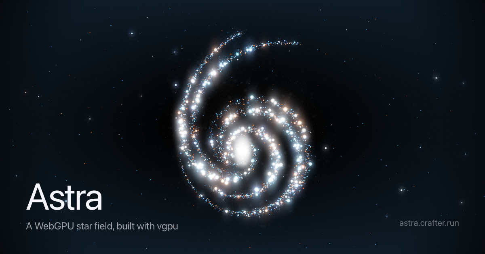

# Astra

[](https://github.com/crafter-station/astra)
[](https://astra.crafter.run)
[](https://vgpu.sh)



A WebGPU star field, built only with [vgpu](https://vgpu.sh) inside Next.js.

Live at **[astra.crafter.run](https://astra.crafter.run)**.

Drag to rotate, hover to scatter, arrow keys to nudge.

## Run it

```sh
pnpm install
pnpm dev
```

Open http://localhost:3000 in a WebGPU-capable browser.

## How it works

Stars flow along five SVG strokes that draw a "6". A compute pass moves every
star, then additive quads draw them into an HDR scene. Bloom, a lens flare and a
dirty-glass pass finish with ACES tone mapping.

All of it lives in `components/spiral-galaxy/`.

## Other commands

```sh
pnpm check:wgsl   # validate every shader against a real WebGPU device
pnpm og           # re-render the Open Graph card from the live scene
pnpm capture      # save headless WebGPU frames to captures/
pnpm typecheck
pnpm build
```

`og` and `capture` need Node 22+ and Google Chrome.
